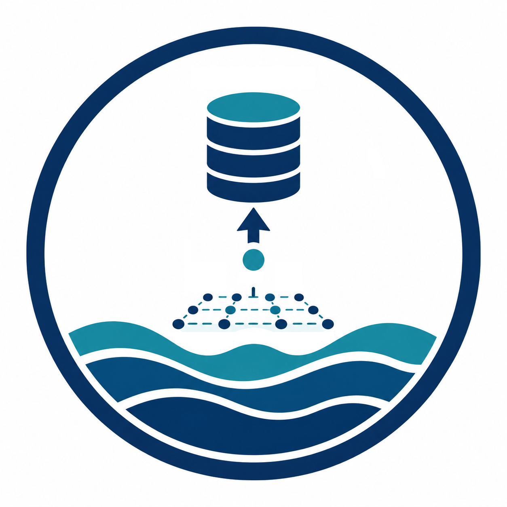

# Humboldt Current Environmental Data<br>Workflow

Reproducible workflow for acquiring, quality-controlling, harmonizing, deriving, cataloguing, and reusing oceanographic and environmental data across the Humboldt Current System (HCS).

The repository records the scientific data contract, product registry, processing decisions, provenance, quality-control gates, and reusable catalog. Heavy NetCDF, GeoTIFF, Zarr, HDF5, GRIB, and related products remain outside GitHub in an external data store.

<br clear="right">

## Repository role

This is a `type-workflow` repository. It separates three responsibilities:

1. **Software engine** — [`qselmer/oceancube`](https://github.com/qselmer/oceancube) provides reusable operations for oceanographic data acquisition, extraction, harmonization, derivation, and quality control.
2. **HCS workflow and catalog** — this repository freezes domains, providers, products, variables, processing rules, provenance, and certification decisions.
3. **External data store** — heavy source and derived environmental products are stored outside GitHub and referenced by relative paths, manifests, checksums, and catalog records.

Paper repositories consume certified subsets of this environmental store; they should not independently rebuild the master HCS archive unless a paper requires a deliberately different product or processing contract.

## Scientific scope

The master domain is the Humboldt Current System rather than a single species or stock. It is intended to support environmental covariates for fisheries, ecosystem, habitat, recruitment, SDM/ENM, stock-assessment, MSE, fleet-distribution, and climate-risk analyses in Peru and Chile.

Candidate environmental families include:

- sea-surface temperature and salinity;
- mixed-layer depth;
- dissolved oxygen and oxycline diagnostics;
- chlorophyll-a and primary productivity;
- sea-surface height / absolute dynamic topography;
- currents and eddy kinetic energy;
- wind, wind stress, and Ekman/upwelling diagnostics;
- bathymetry, coastline, and distance to coast;
- fronts, gradients, and additional climate products when scientifically justified.

Native source resolution is preserved. Regridding creates a declared derived product and never replaces the original source.

## Data architecture

```text
external HCS data store/
├── cin/
│   ├── raw/                # immutable provider files
│   ├── interim/            # standardized / partially harmonized products
│   ├── processed/          # certified reusable analytical products
│   └── metadata/           # provider metadata and provenance
└── cout/
    ├── qc/
    ├── reports/
    └── logs/
```

The GitHub repository contains only the lightweight, version-controlled layer:

```text
oceHCS-environmental-data-workflow/
├── config/                 # scientific and processing contracts
├── R/                      # project-level orchestration helpers
├── workflow/               # auditable Quarto workflow
├── catalog/                # products, variables, files, coverage, checksums
├── metadata/               # catalog schemas and provenance definitions
├── tests/                  # repository-contract validation
├── docs/                   # architecture and catalog documentation
├── assets/                 # repository branding
├── local/                  # local mount placeholder; heavy data ignored
├── repo.yml                # canonical repository metadata
└── index.qmd               # Quarto workflow homepage
```

## Workflow

```text
DOMAIN
  ↓
PRODUCT REGISTRY
  ↓
ONE VARIABLE FAMILY AT A TIME
  ↓
ACQUISITION
  ↓
SOURCE QC
  ↓
STANDARDIZATION / DERIVATION
  ↓
SPATIOTEMPORAL COVERAGE QC
  ↓
CATALOG + PROVENANCE CERTIFICATION
  ↓
GO / REVIEW / STOP
  ↓
REUSE VALIDATION
```

A high global coverage percentage is never sufficient by itself. Coverage must be evaluated by time block, spatial domain, product, variable, and downstream scientific unit so that entire surveys, periods, or regions cannot silently disappear from later analyses.

## Catalog contract

`config/*.yml` records scientific intent and frozen processing decisions. `catalog/*.csv` records certified products and artifacts generated under those decisions. The two layers are not interchangeable and should not be edited as duplicate sources of truth.

Current catalog tables are:

- `catalog/products.csv` — provider, product, dataset, version, resolution, temporal support, licence, and access identity;
- `catalog/variables.csv` — canonical variables, units, roles, derivation dependencies, and status;
- `catalog/files.csv` — artifact-level paths, extents, size, processing level, and checksum identity;
- `catalog/coverage.csv` — spatial and temporal support plus QC status;
- `catalog/checksums.csv` — immutable checksum registry.

Machine-readable table contracts are stored under `metadata/schemas/`. See [`docs/catalog-contract.md`](docs/catalog-contract.md).

## Local setup

Copy:

```text
config/paths.example.yml
```

to:

```text
config/paths.local.yml
```

and set the external data root, for example:

```yaml
ocean_data_root: "D:/oceHCS-data"
```

`config/paths.local.yml`, credentials, caches, and heavy environmental files are excluded from version control.

## Current status

**Development release 0.1.0 — infrastructure and data-governance contract established.**

The HCS geographic bounds and provider product IDs remain deliberately unfrozen. No bulk environmental acquisition should begin until the domain and the first product family have passed scientific review. The intended development sequence is to freeze the domain, certify one environmental family at a time, and propagate only artifacts that receive a documented `GO` decision.

## Reproducibility

Certified catalog releases should freeze the domain, provider/product versions, variable definitions, processing rules, catalog manifests, checksums, relevant `oceancube` version, and numerical/software dependencies required to reconstruct processed products.

## Citation and licence

See [`CITATION.cff`](CITATION.cff) for repository citation metadata. Code and repository infrastructure are released under the [MIT License](LICENSE). Environmental products remain subject to the licences and terms of their original providers.
